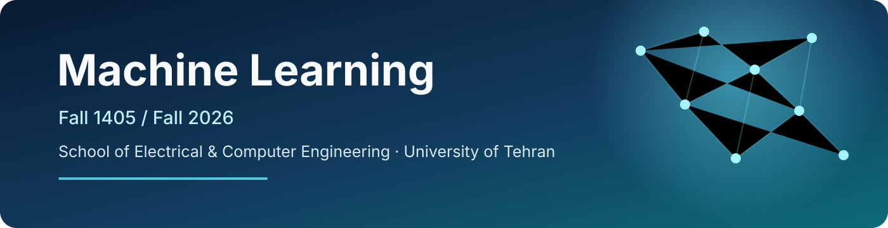

  

<h1 align="center">Machine Learning — Fall 1405 / Fall 2026</h1>

  <strong>Official Course Repository · School of Electrical & Computer Engineering · University of Tehran</strong>

  
  
  

  
  
  
  
  

  <a href="lectures/"><strong>Lectures</strong></a> ·
  <a href="assignments/"><strong>Assignments</strong></a> ·
  <a href="quizzes/"><strong>Quizzes</strong></a> ·
  <a href="project/"><strong>Final Project</strong></a> ·
  <a href="ta-sessions/"><strong>TA Sessions</strong></a> ·
  <a href="resources/"><strong>Resources</strong></a>

---

## 🎓 Course Overview

This repository is the student-facing home for **Machine Learning — Fall 1405 (Fall 2026)** at the University of Tehran. It contains public material for both the graduate **Machine Learning** section and the undergraduate **Introduction to Machine Learning** section.

### Instructors

- [**Dr. Mostafa Tavassolipour**](https://scholar.google.com/citations?hl=en&user=oVAT1lYAAAAJ)
- [**Dr. Mohammad-Reza Abolghasemi Dehaqani**](https://scholar.google.com/citations?user=HuMGDxIAAAAJ&hl=en)
- [**Prof. Babak Nadjar Araabi**](https://scholar.google.com/citations?hl=en&user=FTcata0AAAAJ)

### Course Coordination & Supervision

| Role | Staff |
|---|---|
| **Course Coordinator & Supervisor** | [**Mostafa Kermani Nia**](https://github.com/mostafa-kermaninia) |
| **Supervisor** | [**Mohammad Amanlou**](https://github.com/MohammadAmanlou) |
| **Supervisor** | [**Amir Naddaf Fahmideh**](https://github.com/AmirNaddaf2004) |
| **Supervisor** | [**Faezeh Mozaffari**](https://www.linkedin.com/in/faezeh-mozaffari-7816b6230) |

### Teaching Assistants

[Aida Roshani](https://www.linkedin.com/in/aida-roshani) ·
[Mohammad Erfan Danayi](https://github.com/medanaee) ·
[Yasaman Amou Jafary](https://www.linkedin.com/in/yasaman-amou-jafary-720134377) ·
[Mohammad Amin Nosrati](https://www.linkedin.com/in/mohammad-amin-nosrati-a11327215) ·
[Amin Aghakasiri](https://github.com/Amink8203) ·
[Hossein Lashgari](https://www.linkedin.com/in/hossein-lashgari) ·
[Amirhossein Arefzadeh](https://github.com/amir-rfz) ·
[Mohammadmahdi Yari](https://github.com/mahdiyari15) ·
[Saman Davachi Tousi](https://github.com/Saman2C) ·
[Mani Hosseini](https://github.com/manih1384) ·
[Paria Pasehvarz](https://github.com/PariaPasehvarz) ·
[Alireza Zamani](https://www.linkedin.com/in/zalireza) ·
[Hamidreza Talei](https://github.com/Hamidreza-Talei) ·
[Shahab Sherafat](https://ir.linkedin.com/in/shahab-sherafat-2a6712236)

---

## 🧭 Quick Access

| | Course Area | What you will find |
|:--:|---|---|
| 🎞️ | [**Lectures**](lectures/) | Slides and instructor-approved lecture material |
| 🧠 | [**Assignments**](assignments/) | HW1–HW5, starter notebooks, datasets, and public release files |
| ⚡ | [**Quizzes**](quizzes/) | Quiz information and public post-release material |
| 🏆 | [**Final Project**](project/) | Three project phases, public instructions, and resources |
| 🧑‍🏫 | [**TA Sessions**](ta-sessions/) | Tutorials, review sessions, and problem-solving material |
| 📚 | [**Resources**](resources/) | Supplementary references, notebooks, and helper material |
| 📝 | [**Course Docs**](docs/) | Description, calendar, policies, and repository documentation |
| 🧪 | [**Exams**](exams/) | Public midterm/final material when appropriate |

---

## 📌 Course Essentials

| Item | Confirmed information |
|---|---|
| **Fall 1405 classes begin** | **1405/07/04 (2026-09-26)** |
| **Graduate lectures** | **Saturday & Monday, 10:30–12:00, Class 2** |
| **Undergraduate lectures** | **Saturday & Monday, 15:00–16:30** · classroom TBA |
| **Shared TA session** | **Monday, 12:00–13:00** |
| **Graduate final exam** | **1405/11/10 (2027-01-30), 08:30–11:30** · room TBA |
| **Undergraduate final exam** | **1405/11/10 (2027-01-30), 14:00–17:00** · room TBA |
| **Official announcements** | **eLearn** is the authoritative announcement channel |

> [!IMPORTANT]
> Calendar details may be updated during the semester. When there is a conflict, official eLearn announcements and the approved course calendar take precedence over summaries in this repository.

---

## 🧩 Syllabus

| Foundations | Models & Optimization | Advanced Topics |
|---|---|---|
| Introduction to ML Concepts | Maximum Likelihood Estimation | Decision Trees |
| Introduction to Data | Optimization | Support Vector Machines |
| Bayesian Classifiers | Logistic Regression | Neural Networks |
| Risk Minimization & Decision Boundaries | Linear Regression | PCA / LDA |
| Naive Bayes | Non-Linear Regression | Feature Selection · Clustering |
|  |  | **Mixture Models · Expectation-Maximization (EM)** |

The exact pacing may change during the semester according to instructor decisions and the official calendar.

---

## 📊 Assessment & Passing Policy

The same core grading structure applies to both sections:

| Component | Points |
|---|---:|
| 5 Assignments | **5** |
| 5 Quizzes | **2** |
| Midterm Exam | **5** |
| Final Exam | **6** |
| Final Project | **3** |
| **Total available** | **21** |

The final course grade is reported out of **20**, so up to **1 point** functions as bonus credit.

> [!WARNING]
> **Exam cutoff:** the combined **Midterm + Final Exam** score must be at least **6/11**. A student below this cutoff cannot pass the course regardless of assignment, quiz, or project points.

**Quiz–assignment cutoff:** if a quiz score is below the announced quiz cutoff, its normalized score on the corresponding assignment scale replaces the score of the corresponding assignment. The numerical cutoff and mapping details are announced through the official course channels.

This assessment policy assumes **in-person delivery**. If the University moves the course online or changes the teaching mode materially, quiz/exam mechanics and related rules may be revised by the instructors and announced officially.

---

## 🗺️ Semester Roadmap

| Block | Core topics | Expected activity |
|:--:|---|---|
| **01** | Data · Bayesian Classification · Risk Minimization · Naive Bayes | HW1 · Quiz 1 |
| **02** | MLE · Optimization | HW2 · Quiz 2 |
| **03** | Regression · Decision Trees · SVM | HW3/HW4 · Quizzes 3–4 · Midterm |
| **04** | Neural Networks · PCA/LDA | Project Phase 2 · HW5 preparation |
| **05** | Feature Selection · Clustering · Mixture Models · EM · Review | Quiz 5 · Project Phase 3 · Final preparation |

For exact dates, use the official course calendar rather than this high-level roadmap.

---

## 🧠 Assignments & Reproducibility

The course includes **five individual assignments** combining theoretical work and programming. Programming submissions are expected to be reproducible in **Python 3 / Jupyter**.

Graduate students may receive **one or two additional advanced questions** in each assignment, including questions based on material taught only in the graduate section. These graduate-only questions are not required in Introduction to Machine Learning.

---

## 🏆 Final Project

The final project is organized in **three phases** and is completed in groups of four. Some advanced components may be designated as **mandatory for graduate Machine Learning teams** and **optional bonus work for Introduction to Machine Learning teams**.

The project culminates in an **oral defense**. Every team member is expected to understand the complete project, and individual scores may differ according to demonstrated understanding and contribution.

---

## 🛡️ Academic Integrity

Students must understand and be able to explain the work they submit, including AI-assisted text, derivations, or code. Ready-made Internet code and AI-generated material that the student cannot explain are not acceptable course submissions.

The public repository intentionally excludes unpublished solutions, private rubrics, grades, student data, and staff-only assessment material.

---

## 🔧 Repository Workflow

This is the **public/student-facing repository**. Draft solutions, grading rubrics, answer keys, student records, and unreleased assessment material belong in a separate private staff workspace.

Course staff should use branches and pull requests for substantive changes. See [`CONTRIBUTING.md`](CONTRIBUTING.md) for the release workflow and review checklist.

---

## 📣 Communication

- **Official announcements:** eLearn
- **Supplementary communication:** Telegram, when announced by the course staff
- **Course questions:** use the channels announced by the instructors/course staff
- **Repository corrections:** GitHub Issues may be used for typos, broken links, or missing public files

---

  <strong>Machine Learning · University of Tehran · Fall 1405 / Fall 2026</strong> 
  Learn the foundations. Build the models. Understand the decisions.

